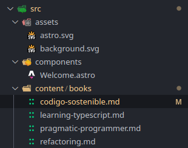

# Curso Astro 5: Server Islands, View Transitions + Aplicación

## Información de cada libro (MD)

Vamos a utilizar la tecnología de content layer, porque en Astro podemos hacer muchas cosas interesantes con las llamadas colecciones. Y además son colecciones que podemos sacar de cualquier sitio, por ejemplo de una API externa, de archivos markdown, de un JSON, etc.

>[!note]
>El frontmatter es información extra que puedes poner en un markdown



Creamos un directorio `content` y añadimos la información de los libros en archivos markdown en nuevo directorio llamado `books` dentro de content, usando este formato para los markdown.md:

**codigo-sostenible.md**

```markdown
---
title: Codigo Sostenible
author: Carlos Blé
img: codigo-sostenible.jpg
readtime: 1540 
description: Un libro que nos enseña a escribir código limpio y sostenible, con un enfoque en la calidad del software y la importancia de la colaboración en equipo.
buy:
  spain: https://amzn.eu/d/8YyTZLn
  usa: https://a.co/d/1aECGWn
---

**El libro que nos hubiera gustado tener entre nuestras manos cuando estábamos aprendiendo a programar.**
Una guía para quienes buscan la satisfacción del código bien hecho.
¿Te has planteado alguna vez cómo sería programar sin prisas, sin parches y sin chapuzas?
Tras veinte años de carrera como programador, consultor, conferenciante y formador, **Carlos Blé plasma lo mejor de sus enseñanzas en este libro.**
“Cada vez escuchamos más eso de que en el desarrollo de software está todo inventado, 
pero apuesto a que al finalizar este libro compartiremos que publicaciones como esta aportan valor a la profesión”
Javier Ferrer, co-fundador de Codely.tv
```

## Schema de libros

Ahora que ya tenemos el contenido tenemos que crear una colección.

Tenemos que indicarle de alguna forma que estos libros son una colección.

Vamos a explicar qué atributos tiene nuestra colección.

Así que dentro del directorio `content` vamos a crear un nuevo archivo llamado `config.ts` 

>[!Note]
>El archivo `src/content/config.ts` es opcional. Sin embargo, si eliges no definir tus colecciones, deshabilitarás algunas de sus mejores características como la validación del esquema del frontmatter o la generación automática de tipos de datos en TypeScript.

**config.ts**

```tsx
import { defineCollection, z } from 'astro:content';
// z -> zod schema

const books = defineCollection({
  schema: z.object({
    title: z.string(),
    author: z.string(),
    img: z.string(),
    readtime: z.number(),
    description: z.string(),
    buy: z.object({
      spain: z.string().url(),
      usa: z.string().url(),
    })
  })
})

export const collections = { books }
```

## Renderizar libros

Ahora vamos a ir a nuestro `index.astro`y mostrar la colección, es decir, leer la colección.

>[!Note]
>La propiedad slug contiene el nombre del fichero sin la extensión

**index.astro**

```jsx
---
import { getCollection } from 'astro:content';
import Welcome from '../components/Welcome.astro';
import Layout from '../layouts/Layout.astro';

const books = await getCollection('books');
---

<Layout title="DevBooks, libros para programadores">
	<main>
		<h1 class="text-center text-7xl font-extrabold mb-24">Dev 👨🏻‍💻
			<span class="block">Books</span>
		</h1>
		
		<section aria-label="Libros recomendados para programadores">
			<div class="px-4 mx-auto max-w-screen-xl">
				<div class="grid gap-6 md:grid-cols-2">
					{
						books.map(book => {
							const { slug, data } = book
							const { title, author, img, readtime, description, buy } = data
							
							return (
								<article class="flex">
									<a href={`/libro/${slug}`} class="mb-2 xl:mb-0 transition hover:scale-110">
										
									</a>

									<div class="flex flex-col justify-center">
										<h2 class="mb-2 text-2xl font-bold leading-tight text-white">
											{title}
										</h2>
										<p class="mb-4 text-gray-300 max-w-sm">{description}</p>
										<span class="text-xs">⏳ Lectura en {readtime} minutos</span>
									</div>
								</article>
							)
						})
					}
				</div>
			</div>
		</section>
	</main>
</Layout>
```

Con esto ya tenemos algo así:


Pero si hacemos click en uno de libros:


Y esto se debe a que no hemos creado las páginas de los libros.

## Páginas dinámicas

Vamos a crear una página con una ruta dinámica, porque cada libro tiene un identificador diferente.

>[!Note]
>La función `getStaticPaths` tiene que devolver un array con todas las rutas que queremos que respondan con algo, y qué información debe tener cada una de las rutas. 

**[id].astro**

```jsx
---
import { getCollection } from "astro:content";
import Layout from "../../layouts/Layout.astro";

export async function getStaticPaths(){
  return [
    {
      params: { id: "codigo-sostenible" },
      props: { title: "Código Sostenible" },
    },
    {
      params: { id: "learning-typescript" },
      props: { title: "Learning TypeScript" },
    }
  ]
}

const { title } = Astro.props;
---

<Layout title={`${title} - Dev Books`}>
  <h1>{title}</h1>
</Layout>
```

Lo que estamos diciéndole en cada caso es: Que sepas que con el identificador tal, tenemos que devolver la página con la información que te estoy diciendo.

Pero esto no lo debemos hacer así a mano, salvo en determinadas excepciones, pero en nuestro caso no tiene sentido, ya que si tenemos la colección, ya que justamente podemos recuperar la colección de libros y con la colección libros, vamos a mapear cada libro (un map devuelve un array) y para cada posición del array (que va a ser cada uno de los libros) vamos a devolver el parámetro de `id` con `slug` y en las `props` vamos a pasar toda la información del libro.

**[id].astro**

```jsx
---
import { getCollection } from "astro:content";
import Layout from "../../layouts/Layout.astro";

export async function getStaticPaths(){
  /* Forma manual, no conveniente */
  /*
  return [
    {
      params: { id: "codigo-sostenible" },
      props: { title: "Código Sostenible" },
    },
    {
      params: { id: "learning-typescript" },
      props: { title: "Learning TypeScript" },
    }

    const { title } = Astro.props;
  ]*/

  const books = await getCollection("books");

  return books.map((book) => ({
    params: { id: book.slug },
    props: { book },
  }))
}

  const { book } = Astro.props;
  const { data } = book;
  const { title, author, img, readtime, description, buy } = data;
---

<Layout title={`${title} - Dev Books`}>
  <h1>{title}</h1>
</Layout>
```

Ahora vamos a mejorar los estilos y a renderizar el contenido de los markdown.

**[id].astro**

```jsx
---
import { getCollection, render } from "astro:content";
import Layout from "../../layouts/Layout.astro";

export async function getStaticPaths(){

  const books = await getCollection("books");

  return books.map((book) => ({
    params: { id: book.slug },
    props: { book },
  }))
}

const { book } = Astro.props;
const { data } = book;
const { title, author, img, readtime, description, buy } = data;

const { Content } = await render(book);
---

<Layout title={`${title} - Dev Books`}>
  <div class="flex gap-12">
    <aside class="flex flex-col items-center gap-4">
      
    </aside>

    <main class="max-w-3xl">
      <h1 class="text-4xl font-bold mb-4">{title}</h1>
      <div class="">
        <Content />
      </div>
    </main>
  </div>
</Layout>
```

Resultado provisional:


## Plugin de Tailwind

Existe un plugin de TailwindCSS (oficial de la gente de tailwind) que nos puede venir super bien y es que si nos fijamos en el texto de la imagen de arriba, aunque los estilos no se ven mal del todo, falta separación entre párrafos, entre líneas, no se ve bien del todo.

Este plugin se conoce como tailwindcss-typography. Y nos va a añadir unas clases para que nuestros textos queden genial.

Voy a configurarlo siguiendo el manual oficial del plugin:

https://github.com/tailwindlabs/tailwindcss-typography


**global.css**

```css
@import "tailwindcss";
@plugin '@tailwindcss/typography';

body {
  @apply grid place-content-center p-20;
}

body > div {
  @apply container; 
}
```

**[id].astro**

```jsx
---
import { getCollection, render } from "astro:content";
import Layout from "../../layouts/Layout.astro";

export async function getStaticPaths(){

  const books = await getCollection("books");

  return books.map((book) => ({
    params: { id: book.slug },
    props: { book },
  }))
}

const { book } = Astro.props;
const { data } = book;
const { title, author, img, readtime, description, buy } = data;

const { Content } = await render(book);
---

<Layout title={`${title} - Dev Books`}>
  <div class="flex gap-12">
    <aside class="flex flex-col items-center gap-4">
      
    </aside>

    <main class="max-w-3xl">
      <h1 class="text-4xl font-bold mb-4">{title}</h1>
      <div class="prose prose-invert">
        <Content />
      </div>
    </main>
  </div>
</Layout>
```

En este caso no usamos dark:prose-invert puesto que sólo tenemos un tema y es oscuro.

Y el resultado es que mejora mucho la lectura del texto:


## Animaciones entre páginas

Vamos a implementar las animaciones entre páginas.

**Layout.astro**

```jsx
---
import "../styles/global.css";
import { ClientRouter } from "astro:transitions";

interface Props {
  title: string;
}

const { title } = Astro.props;
---

<!doctype html>
<html lang="en">
  <head>
    <meta charset="UTF-8" />
    <meta name="viewport" content="width=device-width" />
    <link rel="icon" type="image/svg+xml" href="/favicon.svg" />
    <title>{title}</title>
		<ClientRouter />
  </head>
  <body>
    <div>
      <slot />
    </div>
  </body>
</html>

<style>
  html {
    font-family: system-ui, sans-serif;
    background: #13151a;
    color: #fff;
  }
</style>
```

Ya sólo con esto está haciendo un fade-in fade-out entre una página y otra.

Ahora lo mejor es que vamos a poder hacer animaciones de elementos.

Por ejemplo vamos a tratar de añadir una transición a las imágenes de los libros de forma que cuando pase de una página a la otra haga dicha transición.

Le vamos a dar un nombre a la transición y tiene que ser un nombre único. Ya que si hay más de un elemento que tiene el mismo nombre van a entrar en colisión y no vas a ver ninguna animación.

**index.astro**

```jsx
---
import { getCollection, render } from "astro:content";
import Layout from "../../layouts/Layout.astro";

export async function getStaticPaths(){

  const books = await getCollection("books");

  return books.map((book) => ({
    params: { id: book.slug },
    props: { book },
  }))
}

const { book } = Astro.props;
const { data, slug } = book;
const { title, author, img, readtime, description, buy } = data;

const { Content } = await render(book);
---

<Layout title={`${title} - Dev Books`}>
  <div class="flex gap-12">
    <aside class="flex flex-col items-center gap-4">
      
    </aside>

    <main class="max-w-3xl">
      <h1 class="text-4xl font-bold mb-4">{title}</h1>
      <div class="prose prose-invert">
        <Content />
      </div>
    </main>
  </div>
</Layout>
```

**[id].astro**

```jsx
---
import { getCollection } from 'astro:content';
import Welcome from '../components/Welcome.astro';
import Layout from '../layouts/Layout.astro';

const books = await getCollection('books');
---

<Layout title="DevBooks, libros para programadores">
	<main>
		<h1 class="text-center text-7xl font-extrabold mb-24">Dev 👨🏻‍💻
			<span class="block">Books</span>
		</h1>
		
		<section aria-label="Libros recomendados para programadores">
			<div class="px-4 mx-auto max-w-screen-xl">
				<div class="grid gap-6 md:grid-cols-2">
					{
						books.map(book => {
							const { slug, data } = book
							const { title, author, img, readtime, description, buy } = data
							
							return (
								<article class="flex">
									<a href={`/libro/${slug}`} class="mb-2 xl:mb-0 transition hover:scale-110">
										
									</a>

									<div class="flex flex-col justify-center">
										<h2 class="mb-2 text-2xl font-bold leading-tight text-white">
											{title}
										</h2>
										<p class="mb-4 text-gray-300 max-w-sm">{description}</p>
										<span class="text-xs">⏳ Lectura en {readtime} minutos</span>
									</div>
								</article>
							)
						})
					}
				</div>
			</div>
		</section>
	</main>
</Layout>
```

Básicamente lo que estamos haciendo es crear una asociación de 2 páginas distintas, es decir, estamos diciendo que hay 2 elementos del DOM que están relacionados a través del transition:name.

Automáticamente el navegador entiende que estos 2 elementos son el mismo y lo que hace es moverlo entre una página y otra, es decir, lo que hace es transicionar el elemento entre una página y otra.

>[!Important]
>No es una SPA. Esto es CSS.

Esto mismo lo podemos hacer con otros elementos, no solo con imágenes, para verlo vamos a hacerlo con el título.

**index.astro**

```jsx
---
import { getCollection } from 'astro:content';
import Welcome from '../components/Welcome.astro';
import Layout from '../layouts/Layout.astro';

const books = await getCollection('books');
---

<Layout title="DevBooks, libros para programadores">
	<main>
		<h1 class="text-center text-7xl font-extrabold mb-24">Dev 👨🏻‍💻
			<span class="block">Books</span>
		</h1>
		
		<section aria-label="Libros recomendados para programadores">
			<div class="px-4 mx-auto max-w-screen-xl">
				<div class="grid gap-6 md:grid-cols-2">
					{
						books.map(book => {
							const { slug, data } = book
							const { title, author, img, readtime, description, buy } = data
							
							return (
								<article class="flex">
									<a href={`/libro/${slug}`} class="mb-2 xl:mb-0 transition hover:scale-110">
										
									</a>

									<div class="flex flex-col justify-center">
										<h2 transition:name={`title-${slug}`} class="mb-2 text-2xl font-bold leading-tight text-white">
											{title}
										</h2>
										<p class="mb-4 text-gray-300 max-w-sm">{description}</p>
										<span class="text-xs">⏳ Lectura en {readtime} minutos</span>
									</div>
								</article>
							)
						})
					}
				</div>
			</div>
		</section>
	</main>
</Layout>
```

**[id].astro**

```jsx
---
import { getCollection, render } from "astro:content";
import Layout from "../../layouts/Layout.astro";

export async function getStaticPaths(){
  /* Forma manual, no conveniente */
  /*
  return [
    {
      params: { id: "codigo-sostenible" },
      props: { title: "Código Sostenible" },
    },
    {
      params: { id: "learning-typescript" },
      props: { title: "Learning TypeScript" },
    }

    const { title } = Astro.props;
  ]*/

  const books = await getCollection("books");

  return books.map((book) => ({
    params: { id: book.slug },
    props: { book },
  }))
}

const { book } = Astro.props;
const { data, slug } = book;
const { title, author, img, readtime, description, buy } = data;

const { Content } = await render(book);
---

<Layout title={`${title} - Dev Books`}>
  <div class="flex gap-12">
    <aside class="flex flex-col items-center gap-4">
      
    </aside>

    <main class="max-w-3xl">
      <h1 transition:name={`title-${slug}`} class="text-4xl font-bold mb-4">{title}</h1>
      <div class="prose prose-invert">
        <Content />
      </div>
    </main>
  </div>
</Layout>
```

>[!Tip]
>No mover todos los elementos de una pantalla, porque sino va a quedar mal. Con que movamos uno en concreto ya está.

## Trabajando con variables .env & Cargar la valoración

Una cosa buena que tiene Astro en la versión 5 es que hay una forma muy avanzada o integrada de leer variables de entorno que además nos permite tiparlas.

```jsx
SHOW_BUY_BUTTON="true"
SCORE_API_ENDPOINT="https://www.random.org/integers/?num=1&min=1&max=5&col=1&base=10&format=plain&rnd=new"
```

>[!Important]
>Las variables de entorno que definimos en el archivo .env son cadenas de texto, independendiente de si la ponemos sin “”:
>SHOW_BUY_BUTTON:true

Con Astro podemos indicar de qué tipo son, dónde se pueden utilizar (en el contexto del servidor o del cliente) y qué acceso debe tener (si es público o es un secreto).

```jsx
// @ts-check
import { defineConfig, envField } from 'astro/config';

import tailwindcss from '@tailwindcss/vite';

// https://astro.build/config
export default defineConfig({
  vite: {
    plugins: [tailwindcss()]
  },
  env: {
    schema: {
      SHOW_BUY_BUTTON: envField.boolean({ default: true, context: "server", access: "public"}),
      SCORE_API_ENDPOINT: envField.string({ context: "client", access:"public" })
    }
  }
});
```

>[!Note]
>Con el comando npx astro sync podemos sincronizar las colecciones, el contenido, los tipos, optimiza las dependencias y ahí como que limpia la caché y te detecta otra vez bien los tipos.

Ahora vamos a leer dichas variables de entorno y a utilizarlas para entre otras cosas cargar una valoración aleatoria para los libros.

**[id].astro**

```jsx
---
import { getCollection, render } from "astro:content";

// This import is only available in the server context
import { SHOW_BUY_BUTTON } from "astro:env/server";

import Layout from "../../layouts/Layout.astro";
import AmazonLogo from "../../components/AmazonLogo.astro";
import BuyButton from "../../components/BuyButton.astro";

export async function getStaticPaths(){
  const books = await getCollection("books");

  return books.map((book) => ({
    params: { id: book.slug },
    props: { book },
  }))
}

const { book } = Astro.props;
const { data, slug } = book;
const { title, author, img, readtime, description, buy } = data;

const { Content } = await render(book);
---

<Layout title={`${title} - Dev Books`}>
  <div class="flex gap-12">
    <aside class="flex flex-col items-center gap-4">
      <a href="/" class="hover:underline opacity-70">⬅️ Volver atrás</a>
      
      <span class="text-xs" id="score"></span>
      {
        SHOW_BUY_BUTTON && <BuyButton buy={buy} />
      }
    </aside>

    <main class="max-w-3xl">
      <h1 transition:name={`title-${slug}`} class="text-4xl font-bold mb-4">{title}</h1>
      <div class="prose prose-invert">
        <Content />
      </div>
    </main>
  </div>
</Layout>

<script>
  // This import is only available in the client context
  import { SCORE_API_ENDPOINT } from "astro:env/client";

  const scoreElement = document.querySelector('#score')

  fetch(SCORE_API_ENDPOINT)
    .then(res => res.text())
    .then(scoreValue => { 
      if (scoreElement) {
        scoreElement.innerHTML = `⭐ Puntuación: ${scoreValue.trim()}/5`
      }
    })
</script>
```

Para esta implementación he hecho uso de 2 componentes ya creados.

**AmazonLogo.astro**

```jsx
<svg
  class="h-5 w-5"
  xmlns="http://www.w3.org/2000/svg"
  width="800"
  height="800"
  viewBox="0 -1 20 20"
  ><path
    d="M17.251 13.716c.393-.102 1.304-.265 1.691-.18.545.049.873.139.982.27.231.343-.115 1.544-.273 1.935-.139.344-.79 1.45-1.127 1.45-.103 0-.18-.076-.128-.217 1.237-2.88.684-2.803-1.145-2.646-.236.029-1.102.202-1 0 0-.238.761-.55 1-.612M8.633 8.478c0 .469.118.844.354 1.125.676.806 1.91.374 2.428-.584.285-.49.581-1.445.581-2.683-1 0-1.318.048-1.68.144-1.068.3-1.683.967-1.683 1.998m-3.127.36c0-1.686.908-2.868 2.31-3.455 1.236-.522 2.943-.665 4.18-.739 0-1.483-.203-2.664-1.763-2.664-.5 0-1.396.555-1.6 1.481-.049.24-.17.412-.364.447l-2.09-.234c-.254-.06-.352-.198-.292-.438C6.31 1.05 8.145.116 10.233 0c1 0 2.512-.013 3.691 1.062 1.274 1.262 1.072 2.852 1.072 6.967 0 .988.015 1.083.691 1.961.136.202.148.394-.05.54A627.784 627.784 0 0 1 14 11.935c-.146.108-.323.12-.529.036-.895-.76-.68-.714-1.237-1.404-1.129 1.218-2.016 1.549-3.527 1.549-1.796 0-3.2-1.11-3.2-3.276M.324 13.95c3.03 1.74 6.327 2.61 9.891 2.61 2.375 0 4.721-.438 7.036-1.314.351-.139.721-.409.936-.108.103.144.07.276-.1.396C15.844 17.138 12.718 18 9.997 18c-3.852 0-7.278-1.415-9.89-3.744-.234-.191-.048-.472.217-.306"
    fill="#000"
    fill-rule="evenodd"></path></svg
>
```

**BuyButton.astro**

```jsx
---
import AmazonLogo from "./AmazonLogo.astro"

const SPAIN = 'ES'

const country = Astro.request.headers.get('X-Vercel-IP-Country') ?? 'ES'

const storeCountry = country === SPAIN ? 'spain' : 'usa'
const countryName = country === SPAIN ? 'España' : 'Estados Unidos'

const { buy } = Astro.props
const url = buy[storeCountry]
---

<a
  href={url}
  title="Comprar libro"
  target="_blank"
  rel="noopener noreferrer"
  class="text-balance inline-flex gap-2 items-center bg-yellow-400 hover:bg-yellow-500 active:bg-yellow-600 text-black font-bold py-2 px-4 rounded-lg border border-yellow-500 transition duration-200 ease-in-out hover:scale-105 justify-center text-center"
>
  Comprar en Amazon {countryName}
  <AmazonLogo />
</a>
```

>[!TIP]
>En Astro podemos usar <style is:inline> o <style is:global> dependiendo de si queremos que los estilos se apliquen sólo al componente o a toda la aplicación.
>Esto también se puede aplicar a los scripts con <script is:inline> o <script is:global>.


**Extra by ChatGPT**

Cuando usas `<style is:global>` dentro de un componente `.astro`, **los estilos definidos ahí se aplican como CSS global**, es decir, **ya no están scoped al componente**, sino que afectan a cualquier parte de la aplicación que coincida con los selectores.

💡 **Peeero**: ese CSS se incluye **solo si ese componente se renderiza en la página**. Es decir:

- Si el componente **no se usa**, sus estilos globales no se inyectan.
- Si el componente **se usa**, entonces sí: esos estilos aplican globalmente.

### Ejemplo

```
---
// MiComponente.astro
---
<style is:global>
  body {
    background-color: red;
  }
  .titulo {
    font-size: 3rem;
  }
</style>

<h1 class="titulo">Hola mundo</h1>

```

➡️ Si `MiComponente.astro` se usa en una página, el `body` entero se va a pintar rojo, aunque `body` esté en otra parte. La clase `.titulo` también afectará a cualquier elemento con esa clase en cualquier otro componente.

---

**Alternativas**

- Si quieres limitar el alcance: usa `<style>` (sin `is:global`) y Tailwind o estilos scoped.
- Si necesitas estilos globales reales (independientes del componente), es mejor meterlos en un archivo global, como `src/styles/global.css`, e importarlos en el layout o en `src/pages/_app.astro`.

---

¿Quieres aplicar estilos globales a propósito desde un componente? ¿O fue sin querer y te rompió otras cosas?

Resultado:


Lógicamente cada vez que refrescamos la página, la valoración cambia.

## Server Islands

Un problema que tenemos es que al recargar la página del libro hace como un saltito en el botón de Amazon, porque hay como un pequeño retardo al cargar la puntuación.

Para solucionar esto vamos a ver las Server Islands de Astro.

Las Server Islands son componentes que se renderizan en el servidor, y que cuando están listos los devuelve al cliente, pero ya lo que renderiza, no es que haga el fetching en el cliente y tal, no, l renderiza en el servidor y lo devuelve al cliente.

Vamos a externalizar en un nuevo componente la lógica del script de [id].astro además de el span con la puntuación.

**BookScore.astro**

```jsx
---
import { SCORE_API_ENDPOINT } from "astro:env/server";

const res = await fetch(SCORE_API_ENDPOINT)
const scoreValue = await res.text()
---

<span class="text-xs" id="score">
  ⭐ Puntuación: {scoreValue.trim()}/5
</span>

```

El problema de esta implementación es que si hacemos npm run build la puntuación no se va a actualizar en la página resultante. Porque el HTML resultante tras npm run build es estático.

Porque al hacer la build lo que hace es descargar la puntuación y meterla de forma estática en el HTML. Y esto es un problema, porque si queremos que la puntuación vaya cambiando conforme la gente va votando, no va a cambiar hasta que volvamos a hacer un despliegue a producción.

¿Y si pudiéramos hacer de alguna forma que todo fuese estático menos la parte de la puntuación?

Para ello podemos usar las Server Islands de Astro.

Estas nos sirven para decir que un componente queremos que se renderice en el servidor.


>[!Important]
>Cuando usamos `server:defer` en un componente de Astro lo que está haciendo a nivel interno es que haya un elemento vacío y cuando el servidor lo renderice le va a devolver el HTML y lo va a incrustar ahí. Lo cual va a hacer que sea mucho más performante, mucho mejor y que pueda devolver esto al usuario mucho antes.

Lo bueno de este sistema es que podemos usar los `fallbacks`, es decir, que renderice algo mientras se está haciendo lo del servidor.

**astro.config.mjs**

```tsx
// @ts-check
import { defineConfig, envField } from 'astro/config';

import tailwindcss from '@tailwindcss/vite';

// https://astro.build/config
export default defineConfig({
  output: 'server',
  vite: {
    plugins: [tailwindcss()]
  },
  env: {
    schema: {
      SHOW_BUY_BUTTON: envField.boolean({ default: true, context: "server", access: "public"}),
      SCORE_API_ENDPOINT: envField.string({ context: "server", access:"public" })
    }
  }
});
```

**index.astro**

```tsx
---
import { getCollection } from 'astro:content';
import Layout from '../layouts/Layout.astro';

const books = await getCollection('books');

export const prerender = true; // Indicamos que esta página se tiene que prerenderizar
---

<Layout title="DevBooks, libros para programadores">
	<main>
		<h1 class="text-center text-7xl font-extrabold mb-24">Dev 👨🏻‍💻
			<span class="block">Books</span>
		</h1>
		
		<section aria-label="Libros recomendados para programadores">
			<div class="px-4 mx-auto max-w-screen-xl">
				<div class="grid gap-6 md:grid-cols-2">
					{
						books.map(book => {
							const { slug, data } = book
							const { title, author, img, readtime, description, buy } = data
							
							return (
								<article class="flex">
									<a href={`/libro/${slug}`} class="mb-2 xl:mb-0 transition hover:scale-110">
										
									</a>

									<div class="flex flex-col justify-center">
										<h2 transition:name={`title-${slug}`} class="mb-2 text-2xl font-bold leading-tight text-white">
											{title}
										</h2>
										<p class="mb-4 text-gray-300 max-w-sm">{description}</p>
										<span class="text-xs">⏳ Lectura en {readtime} minutos</span>
									</div>
								</article>
							)
						})
					}
				</div>
			</div>
		</section>
	</main>
</Layout>
```

**BookScore.astro**

```tsx
---
import { SCORE_API_ENDPOINT } from "astro:env/server";

const res = await fetch(SCORE_API_ENDPOINT)
const scoreValue = await res.text()
---

<span class="text-xs" id="score">
  ⭐ Puntuación: {scoreValue.trim()}/5
</span>

```

**[id].astro**

```tsx
---
import { getCollection, render } from "astro:content";

// This import is only available in the server context
import { SHOW_BUY_BUTTON } from "astro:env/server";

import Layout from "../../layouts/Layout.astro";
import AmazonLogo from "../../components/AmazonLogo.astro";
import BuyButton from "../../components/BuyButton.astro";
import BookScore from "../../components/BookScore.astro";

export async function getStaticPaths(){
  const books = await getCollection("books");

  return books.map((book) => ({
    params: { id: book.slug },
    props: { book },
  }))
}

const { book } = Astro.props;
const { data, slug } = book;
const { title, author, img, readtime, description, buy } = data;

const { Content } = await render(book);

export const prerender = true; // Indicamos que esta página se tiene que prerenderizar
---

<Layout title={`${title} - Dev Books`}>
  <div class="flex gap-12">
    <aside class="flex flex-col items-center gap-4">
      <a href="/" class="hover:underline opacity-70">⬅️ Volver atrás</a>
      
      <BookScore server:defer id={slug}>
        <span slot="fallback" class="text-xs opacity-70">Cargando puntuación...</span>
      </BookScore>
      {
        SHOW_BUY_BUTTON && <BuyButton buy={buy} />
      }
    </aside>

    <main class="max-w-3xl">
      <h1 transition:name={`title-${slug}`} class="text-4xl font-bold mb-4">{title}</h1>
      <div class="prose prose-invert">
        <Content />
      </div>
    </main>
  </div>
</Layout>
```

>[!Note]
>Con el `slot="fallback"` podríamos usar un componente.

<aside>


Warning

El problema de usar el modo servidor de Astro es que obviamente necesitaremos un servidor, pero contamos con opciones como Deno Deploy o Cloudflare Pages que nos ofrecen serverless functions.

Deno Deploy es una muy buena opción puesto que es muy fácil desplegarlo ahí y que cuenta con una capa gratuita bastante considerable.

Ya que en definitiva, no haría falta que este el servidor abierto todo el rato.

</aside>

## Cambiar de botón según la ubicación

Para realizar esto vamos a utilizar una funcionalidad de Vercel (lógicamente tendremos que desplegar la aplicación allí) que nos permite a través de los headers recuperar el país del usuario.

**BuyButton.astro**

```tsx
---
import AmazonLogo from "./AmazonLogo.astro"

const SPAIN = 'ES'

const country = Astro.request.headers.get('X-Vercel-IP-Country') ?? 'ES'

const storeCountry = country === SPAIN ? 'spain' : 'usa'
const countryName = country === SPAIN ? 'España' : 'Estados Unidos'

const { buy } = Astro.props
const url = buy[storeCountry]
---

<a
  href={url}
  title="Comprar libro"
  target="_blank"
  rel="noopener noreferrer"
  class="text-balance inline-flex gap-2 items-center bg-yellow-400 hover:bg-yellow-500 active:bg-yellow-600 text-black font-bold py-2 px-4 rounded-lg border border-yellow-500 transition duration-200 ease-in-out hover:scale-105 justify-center text-center"
>
  Comprar en Amazon {countryName}
  <AmazonLogo />
</a>
```

**[id].astro**

```tsx
---
import { getCollection, render } from "astro:content";

// This import is only available in the server context
import { SHOW_BUY_BUTTON } from "astro:env/server";

import Layout from "../../layouts/Layout.astro";
import AmazonLogo from "../../components/AmazonLogo.astro";
import BuyButton from "../../components/BuyButton.astro";
import BookScore from "../../components/BookScore.astro";

export async function getStaticPaths(){
  const books = await getCollection("books");

  return books.map((book) => ({
    params: { id: book.slug },
    props: { book },
  }))
}

const { book } = Astro.props;
const { data, slug } = book;
const { title, author, img, readtime, description, buy } = data;

const { Content } = await render(book);

export const prerender = true; // Indicamos que esta página se tiene que prerenderizar
---

<Layout title={`${title} - Dev Books`}>
  <div class="flex gap-12">
    <aside class="flex flex-col items-center gap-4">
      <a href="/" class="hover:underline opacity-70">⬅️ Volver atrás</a>
      
      <BookScore server:defer id={slug}>
        <span slot="fallback" class="text-xs opacity-70">Cargando puntuación...</span>
      </BookScore>
      {
        SHOW_BUY_BUTTON && <BuyButton server:defer buy={buy} />
      }
    </aside>

    <main class="max-w-3xl">
      <h1 transition:name={`title-${slug}`} class="text-4xl font-bold mb-4">{title}</h1>
      <div class="prose prose-invert">
        <Content />
      </div>
    </main>
  </div>
</Layout>
```

## ProTip: Variables de entorno

Cuando hacemos la build del proyecto nos sale este error informándonos de que necesitamos un adaptador para usar páginas renderizadas en el lado del servidor:


Así que en nuestro caso, vamos a optar por el adaptador de Vercel:

Ejecutamos **npx astro add vercel**

>[!Note]
>Dependiendo de dónde lo queramos desplegar vamos a tener que usar un adaptador diferente. Vercel, Netlify, Cloudflare, etc.

Pero tras instalar el adaptador de Vercel en nuestro proyecto de Astro y desplegar de nuevo no sale el error de que nos falta la variable de entorno “SCORE_API_ENDPOINT”: 


Normalmente la mayoría de la gente iría a la sección de variables de entorno del proyecto en Astro y las configuraría una a una:


>[!TIP]
>Pero lo increíble es que podemos copiar el contenido del fichero y pegarlo entero de una sola vez pegándolo en el input de la primera key.

>[!TIP]
>No es imprescindible, pero es recomendable usar dobles comillas para indicar los valores en las variables de entorno, porque sino podríamos poner un `false` y confundirnos pensando que se refiere al valor booleano en lugar de a una cadena de texto.